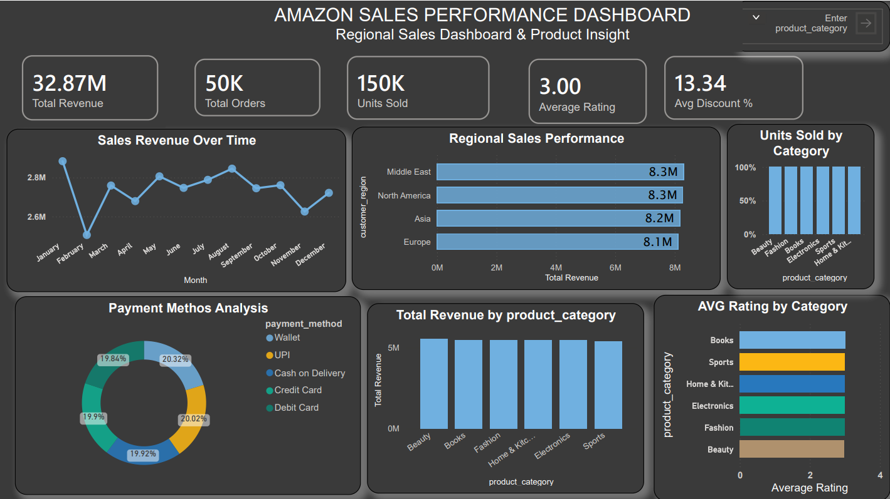

# 📊 Amazon Sales Performance Dashboard (Power BI)

## 📌 Project Overview

This project presents an interactive **Power BI dashboard** analyzing Amazon sales data.
The dashboard provides insights into **sales trends, regional performance, product categories, and payment behavior** to help understand overall business performance.

The dataset used in this project was sourced from **Kaggle** and analyzed using **Power BI** to create an interactive and visually appealing business intelligence dashboard.

---

## 📷 Dashboard Preview

---

## 📈 Key Performance Indicators (KPIs)

* **Total Revenue:** 32.87M
* **Total Orders:** 50K
* **Units Sold:** 150K
* **Average Rating:** 3.00
* **Average Discount:** 13.34%

---

## 📊 Dashboard Insights

Some important insights obtained from the dashboard:

* **North America and Middle East generate the highest revenue.**
* **Electronics and Fashion categories contribute the most to total sales.**
* **UPI and Credit Card are the most frequently used payment methods.**
* **Sales remain relatively consistent across the months.**

---

## 🛠 Tools & Technologies Used

* **Power BI**
* **Data Visualization**
* **Business Intelligence**
* **Kaggle Dataset**
* **Git & GitHub**

---

## 📂 Repository Structure

amazon-sales-powerbi-dashboard
│
├── dataset.csv
├── Amazon_Sales_Dashboard.pbix
├── dashboard.pdf
└── README.md

---

## 🚀 How to Use

1. Download the `.pbix` file from the repository.
2. Open it using **Power BI Desktop**.
3. Explore the interactive dashboard and filters to analyze the sales data.

---

## 📌 Dataset Source

Kaggle – Amazon Sales Dataset

---

## 👨‍💻 Author

**Saivignesh Pandian**
